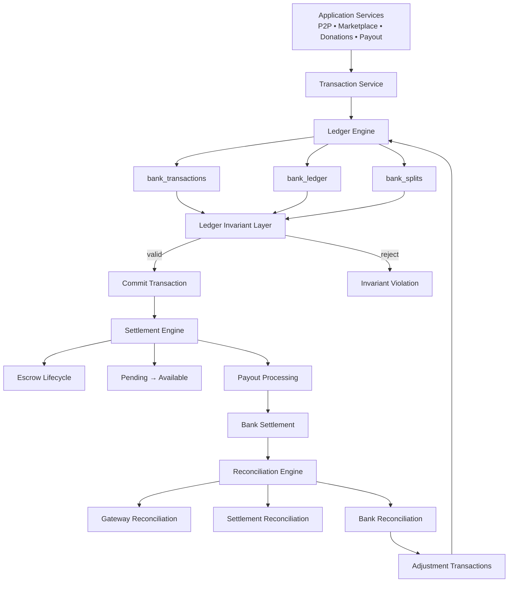
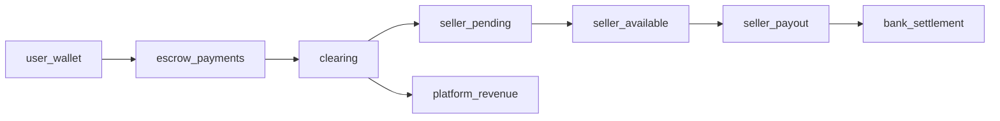
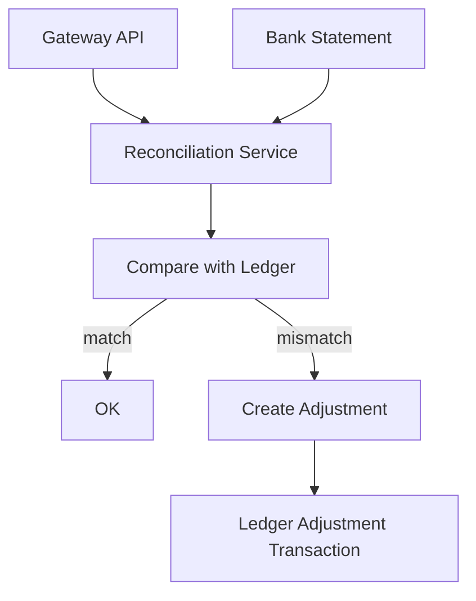

# Arquitetura do Motor Financeiro

Este documento descreve a arquitetura completa do motor financeiro: **ledger + invariants + settlement + reconciliation**.

---

## 1. Visão geral

O motor financeiro possui **quatro camadas principais**:

```
Application Layer
        ↓
Transaction Engine
        ↓
Ledger Engine
        ↓
Invariant Layer (DB)
        ↓
Settlement Engine
        ↓
Reconciliation Engine
```

Cada camada tem uma responsabilidade específica.

---

## 2. Diagrama completo (Mermaid)



---

## 3. Camada 1 — Application Layer

Serviços que iniciam eventos econômicos.

Exemplos:

- P2P transfer
- marketplace checkout
- donation
- ticket purchase
- payout request

Eles **não manipulam dinheiro diretamente**. Eles chamam o **Transaction Service**.

---

## 4. Camada 2 — Transaction Engine

Responsável por:

- iniciar transação SQL
- aplicar row locking
- validar saldo
- criar transaction
- criar ledger entries
- criar splits

Fluxo:

```
BEGIN
  lock account (FOR UPDATE)
  calculate ledger balance
  validate balance
  create bank_transaction
  create ledger debit
  create ledger credit
  create splits
COMMIT
```

---

## 5. Camada 3 — Ledger Engine

Tabelas centrais:

| Tabela             | Papel                       |
| ------------------ | --------------------------- |
| bank_transactions  | evento econômico            |
| bank_ledger        | contabilidade double-entry  |
| bank_splits        | distribuição de valor       |

---

## 6. Camada 4 — Ledger Invariant Layer

Regras protegidas **no banco**.

Invariantes:

```
Σ debits = Σ credits
Σ splits = transaction amount
no negative balances (critical accounts)
ledger append-only
idempotency key unique
```

Se violar → **transaction rejected**.

---

## 7. Camada 5 — Settlement Engine

Gerencia o **lifecycle do dinheiro**.

Fluxo:

```
user_wallet
   ↓
escrow_payments
   ↓
clearing
   ↓
seller_pending
   ↓
seller_available
   ↓
seller_payout
   ↓
bank_settlement
```

Regras importantes:

- **Split** somente após settlement.
- **Payout** somente de saldo available.

---

## 8. Camada 6 — Reconciliation Engine

Verifica se o ledger corresponde ao mundo real.

Três níveis:

| Nível       | Verificação                 |
| ----------- | --------------------------- |
| Transaction | gateway tx ↔ ledger         |
| Settlement  | settlement totals ↔ ledger |
| Bank        | bank statement ↔ ledger     |

---

## 9. Fluxo completo do dinheiro



---

## 10. Fluxo de reconciliação



---

## 11. Estado atual do projeto

Com base no que foi auditado:

| Componente         | Status |
| ------------------ | ------ |
| Ledger Engine      | ✅     |
| Transaction Engine | ✅     |
| Splits             | ✅     |
| Idempotency        | ✅     |
| Ledger Invariants  | ⚠️     |
| Row Locking        | ⚠️     |
| Settlement Engine  | ❌     |
| Reconciliation     | ❌     |

---

## 12. Roadmap técnico

### Fase 1 — Hardening do Motor

- alinhar código ao Genesis
- append-only ledger trigger
- split invariant
- row locking
- saldo não negativo

### Fase 2 — Settlement Engine

- lifecycle de contas
- pending → available
- escrow → settlement
- payout gating

### Fase 3 — Reconciliation Engine

- gateway reconciliation
- settlement reconciliation
- bank reconciliation
- adjustment transactions

---

## Resultado final

Quando tudo estiver implementado:

```
Ledger Engine
+
Invariant Layer
+
Settlement Engine
+
Reconciliation Engine
```

o sistema terá **arquitetura equivalente ao núcleo financeiro usado por fintechs e grandes marketplaces**.
